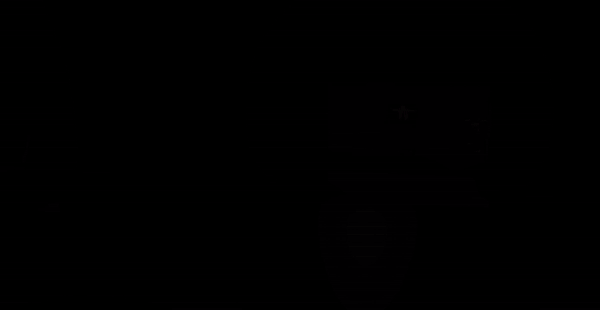

## Description

This is Dream Control, a Unity 3D platformer born from a three-hour game creation challenge with my brother, where each of us crafted a game. Embark on a dark journey through the depths of the subconscious mind. Navigate through dream levels and cutscenes as you attempt to save... yourself.

## Preview

Car level

Kidnapped scene

## Dependencies
Uses the Unity Engine (version 2022.3.29f1) along with the following assets (for more information, please refer to the acknowledgements file):
* Free LowpolyCar by Nextlog Art Factory.
* Standard Assets for Unity 4.6 by Unity Technologies.
* le dancing- music loop by frankum.
* Creepy by mit847.
* Hollow world by lisakale.
* Spray by srar9800.
* Car Burnout by CharleneZ.
* Gasp Male by bertiehs.
* wind and trees and snow by tim.kahn.

## Author
Marius H. Naasen, originally created 2018.
